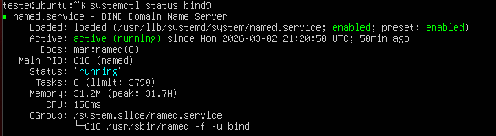
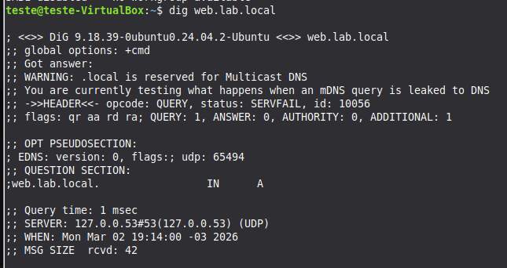
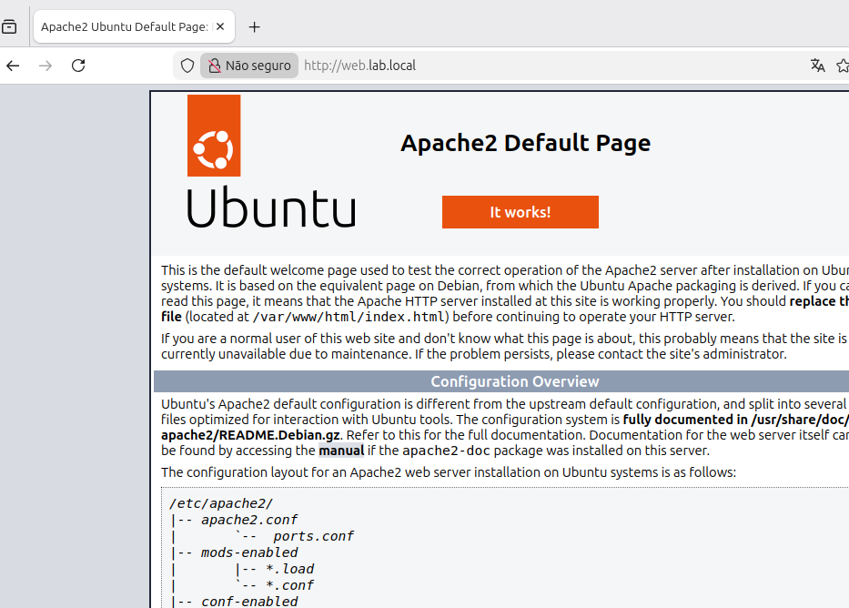

# Projeto: Infraestrutura Web com DNS e DHCP

## Visão Geral

Este projeto simula uma infraestrutura de rede interna composta por três
máquinas virtuais, com integração entre servidor web, servidor DNS e
servidor DHCP.

A proposta foi montar um ambiente funcional onde o cliente acessa o
servidor web utilizando um domínio interno, em vez de acessar
diretamente pelo endereço IP.

------------------------------------------------------------------------

## Estrutura do Ambiente

  ------------------------------------------------------------------------
  Máquina                           IP                      Função
  --------------------------------- ----------------------- --------------
  Servidor Web                      192.168.2.45            Hospedagem da
                                                            aplicação

  Cliente                           192.168.2.44            Testes de
                                                            acesso

  Servidor DNS+DHCP                 192.168.2.46            Resolução de
                                                            nomes e
                                                            distribuição
                                                            de IP
  ------------------------------------------------------------------------

Domínio configurado:

http://web.lab.local

------------------------------------------------------------------------

## Objetivo

Construir um fluxo completo onde:

1.  O cliente recebe IP automaticamente via DHCP\
2.  O cliente recebe o DNS interno automaticamente\
3.  O DNS resolve o domínio web.lab.local\
4.  O cliente acessa o servidor web usando o domínio

------------------------------------------------------------------------

## Servidor Web

### Tecnologias Utilizadas

-   Apache2
-   MySQL
-   PHP

### Instalação

``` bash
sudo apt update
sudo apt install apache2 mysql-server php libapache2-mod-php
```

### Validação

``` bash
systemctl status apache2
```

O servidor foi utilizado para hospedar uma aplicação simples apenas para
validar o funcionamento da resolução DNS e da conectividade da rede.

Acesso realizado via navegador:

http://web.lab.local

------------------------------------------------------------------------

## Servidor DNS + DHCP

### DNS

### Software

-   BIND9

### Instalação

``` bash
sudo apt install bind9
```

### Zona Configurada

lab.local

Registro principal:

web.lab.local -> 192.168.2.45

### Validação da Configuração

``` bash
named-checkconf
named-checkzone lab.local /etc/bind/db.lab.local
```

### Reinício do Serviço

``` bash
sudo systemctl restart bind9
```

### Testes

``` bash
dig web.lab.local
nslookup web.lab.local
```

### DHCP

Responsável por:

-   Distribuir IP automaticamente
-   Informar o DNS interno (192.168.2.46)

### Verificação

``` bash
systemctl status isc-dhcp-server
```

Validação feita verificando:

-   IP atribuído automaticamente ao cliente
-   DNS configurado corretamente no arquivo resolv.conf

------------------------------------------------------------------------

## Fluxo de Funcionamento

1.  Cliente inicia
2.  DHCP entrega IP automaticamente
3.  DHCP informa o DNS interno
4.  Cliente consulta web.lab.local
5.  DNS responde com 192.168.2.45
6.  Cliente acessa o servidor web com sucesso

------------------------------------------------------------------------

## Testes Realizados

-   Concessão automática de IP via DHCP
-   Testes com dig
-   Testes com nslookup
-   Teste de conectividade com ping
-   Acesso via navegador utilizando domínio
-   Verificação dos serviços com systemctl

------------------------------------------------------------------------

## Problemas Encontrados

### Erro na Zona DNS

Erro de sintaxe no arquivo de zona impedia o carregamento do serviço.\
Correção realizada com named-checkzone.

------------------------------------------------------------------------

## Melhorias Futuras

-   Implementar zona reversa (PTR)
-   Separar DNS e DHCP em servidores distintos
-   Aplicar controle de recursão no BIND
-   Criar regras específicas de firewall
-   Implementar monitoramento dos serviços

------------------------------------------------------------------------

## Evidencia de Funcionamento

### Status do DNS


### Teste com DIG


### Acesso com URL do DNS



